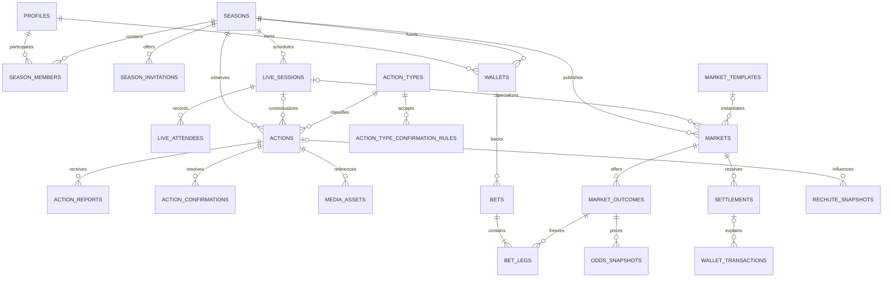

# Base de données MK Bet

## Principes

PostgreSQL/Supabase est la source de vérité de MK Bet. Le schéma public contient 25 tables privées, protégées par Row Level Security sans politique permissive à cette étape. Les identifiants métier utilisent des UUID produits par `gen_random_uuid()`, les horaires sont des `timestamptz`, les montants MKB sont des entiers et les probabilités/cotes utilisent `numeric`.

Les migrations sont forward-only et ne sont jamais exécutées par Next.js, Vercel ou une requête utilisateur. `supabase/seed.sql` ne contient que des données de référence réexécutables.

## Entités et responsabilités

- `profiles`, `seasons`, `season_members`, `season_invitations` décrivent les identités, saisons privées, rôles cumulables et invitations hachées.
- `live_sessions` et `live_attendees` décrivent les événements programmés ou instantanés et leur présence.
- `action_types`, `action_type_confirmation_rules`, `actions`, `action_reports`, `action_confirmations` et `media_assets` portent les faits déclarés, preuves, décisions et références vers Supabase Storage.
- `market_templates`, `markets`, `market_outcomes`, `odds_snapshots` et `market_action_rules` portent les marchés et l’historique explicable des cotes.
- `wallets`, `bets`, `bet_legs`, `settlements` et `wallet_transactions` portent les mises fictives et leur règlement.
- `notifications`, `audit_logs` et `rechute_snapshots` portent les projections utilisateur, la traçabilité et le Rechutomètre.

Les clés étrangères composites empêchent qu’un live, une action, un média ou une issue soit associé à une saison ou un marché incompatible. Des triggers ciblés complètent les règles qui traversent plusieurs tables.

## Relations simplifiées



## Cycles métier

### Saison

Une saison commence en `DRAFT`, devient `ACTIVE`, peut être `PAUSED`, puis se termine en `COMPLETED` ou `ARCHIVED`. Les membres peuvent cumuler plusieurs rôles. Un rôle `SUBJECT` exige exactement une `subject_key`, et une saison ne peut avoir qu’un sujet actif par clé.

### Live

Un live passe de la proposition/planification à l’ouverture des paris, puis aux états armé et live. Il peut être suspendu, terminé, vérifié, réglé, archivé ou annulé. Les heures planifiées restent distinctes des heures réelles.

### Action, déclaration et confirmation

Une **action** est le fait consolidé. `occurred_at` représente l’heure annoncée du fait, `declared_at` l’heure de saisie et `official_occurred_at` l’heure finalement retenue.

Un **report** est le témoignage distinct d’un reporter. Une **confirmation** est la décision d’un membre ou sujet autorisé. `action_types.confirmation_policy` définit la voie principale et `action_type_confirmation_rules` ses alternatives. Une correction crée une nouvelle action liée par `supersedes_action_id`.

### Marché et cote

Un template initialise un marché, ses paramètres de probabilité et sa règle de règlement. Un marché ouvre, peut être suspendu, ferme, reçoit un résultat, puis est réglé, annulé ou remboursé.

`market_outcomes.displayed_odds` est la cote courante. Chaque recalcul crée un `odds_snapshot`. Lors d’un pari, `bet_legs.odds_at_bet`, `fair_probability_at_bet` et `odds_version_at_bet` figent la proposition acceptée : un recalcul futur ne modifie jamais un ticket existant.

### Pari, portefeuille et règlement

Un ticket simple possède une jambe; un combiné en possède plusieurs. Le nombre de jambes, le débit du portefeuille, le ticket et la transaction seront créés atomiquement par une future fonction PostgreSQL.

Un règlement produit une nouvelle ligne `settlements`. Une correction utilise `settlement_type = 'CORRECTION'` et référence le règlement précédent avec `supersedes_settlement_id`; l’historique n’est jamais écrasé.

`wallet_transactions` est un journal immuable : aucun `UPDATE` ni `DELETE` n’est accepté. Chaque correction est une nouvelle transaction idempotente. `audit_logs` suit la même stratégie append-only pour les opérations importantes.

## RLS et sécurité future

La RLS est active sans politiques, ce qui refuse l’accès direct des rôles client par défaut. L’étape Auth et Permissions ajoutera des politiques fondées sur `auth.uid()`, les membres actifs, leurs rôles, la confidentialité des actions et la saison concernée. Les fonctions transactionnelles sensibles devront valider le rôle serveur et ne jamais faire confiance aux montants, cotes ou identifiants transmis par le client.

La fonction `write_audit_log` est interne, `SECURITY DEFINER`, avec un `search_path` vide et sans droit d’exécution pour `public`, `anon` ou `authenticated`.

## Développement et migrations

```bash
pnpm db:start
pnpm db:reset
pnpm db:types
pnpm db:stop
```

`db:reset` repart de zéro, applique les cinq migrations et exécute le seed. Les types de `src/types/database.ts` sont générés depuis la base locale et devront être régénérés après chaque évolution du schéma.

Pour Production, appliquer d’abord les migrations sur une base Supabase Preview ou staging, exécuter les contrôles fonctionnels, puis appliquer les mêmes fichiers versionnés à Production avant de promouvoir une version applicative qui en dépend. Un rollback applicatif Vercel n’annule jamais une migration PostgreSQL.
